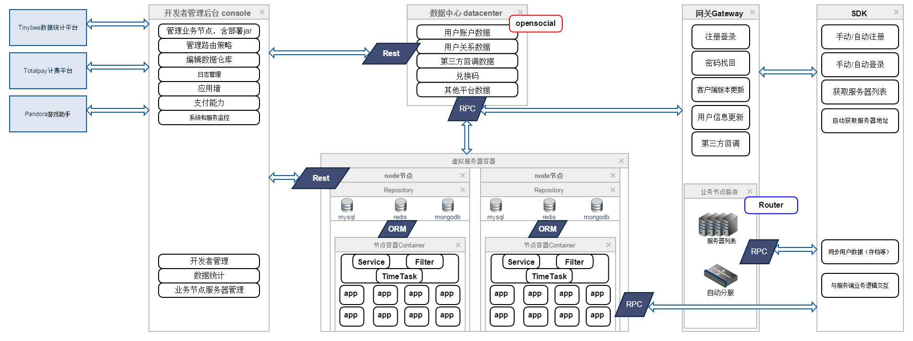

# 总体架构

--

# 1.客户端sdk

## 1.1.注册/登录平台账户

## 1.2.获取游戏服务器（路由）

## 1.3.和服务器通讯交换数据

含武林大会，擂台，比武场，同步存档等，也会封装排行榜，好友列表等标准功能

# 2.平台

## 2.1.网关

### 2.1.1.处理用户注册登录的逻辑

### 2.1.2.处理平台（opensocial）相关数据的请求

### 2.1.3.处理充值或者第三方登录等平台的请求

### 2.1.4.路由客户端获取业务节点的请求

## 2.2.平台（opensocial）数据仓库

通过rest服务（例如spring-data-rest）实现的扩展opensocial来提供对外数据访问

### 2.2.1.用户数据

### 2.2.2.关系数据

### 2.2.3.应用扩展数据（应用的全局数据）

## 2.3.业务节点

分布式，虚拟化的服务器套件

### 2.3.1.应用数据仓库

封装了物理的持久化设施，mysql，mongodb和redis的虚拟持久化设施，通过REST服务（例如spring-data-rest）或者应用容器的orm层访问

### 2.3.2.应用容器

封装了物理http服务器（nginx+tomcat）和tcp服务器的虚拟化设施，通过抽象出的一个轻量级的运行时容器（sdk），让托管的应用（jar形式）动态运行的虚拟服务器

## 2.4.开发者平台

### 2.4.1.管理应用

创建，删除，编辑应用

### 2.4.2.管理业务节点

枚举现有的业务节点，把应用对应的jar包部署/删除到业务节点上

### 2.4.3.管理路由规则

参照现在的分服

### 2.4.4.编辑数据仓库

编辑某个业务节点上的数据仓库
编辑平台的数据仓库中应用的扩展数据

### 2.4.5.查看统计数据

展示平台的一些数据（注册用户等）和从tinybee拿来的一些数据

### 2.4.6.支付能力，应用墙等等

从外部，例如totalpay集成能力进来

## 2.5.管理平台

### 2.5.1.开发者管理

帐号管理

### 2.5.2.数据统计

### 2.5.3.业务节点的管理和监控

# 3.内部系统整合

## 3.1.tinybee

数据统计能力

## 3.2.totalpay

计费能力

## 3.3.uugo

广告能力

# 4.外部系统整合

## 4.1.腾讯开放平台

qq帐号登录

## 4.2.微信开放平台

## 4.3.新浪微博

# 关于数据的层级

# 1.平台数据仓库级别唯一的数据

## 1.1.opensocial相关的数据

用户，关系等

## 1.2.应用扩展数据（全应用/所有业务节点唯一）

例如促销码

# 2.应用数据仓库

## 2.1.单个（业务节点/服务器）应用维度的数据，即服务器维度内唯一

例如排行榜，道具商城，成就列表，公告等

## 2.2.单个（业务节点/服务器）用户维度的数据，即每个用户的数据

例如用户的存档，用户的道具列表，用户的奖励（补偿），用户获得的成就列表

# 关于业务节点的抽象

## 1.设施层

可以是idc的物理主机，也可以是阿里云或者amazon的主机，也可以是cloudfoundry等paas

## 2.系统层

nginx+java+tomcat/websocket+mysql+mongodb+redis+neo4j

## 3.软件层

用spring+springmvc+socket.io+spring-data-*+...构建出一个运行时容器，包含orm（包含一组数据模型和访问方法）和io部分（包含网络通讯，定时器触发），能够动态加载指定的jar，分发网络请求到不同的应用实例上

## 4.应用层

基于运行时sdk开发的应用，能够被动态加载的jar，有指定的数据结构，可以通过orm操作持久化设施，可以通过io来和外部交互或者触发某些特定的逻辑